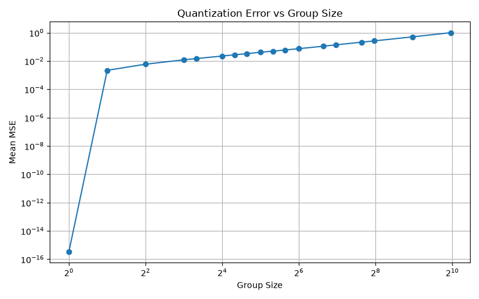
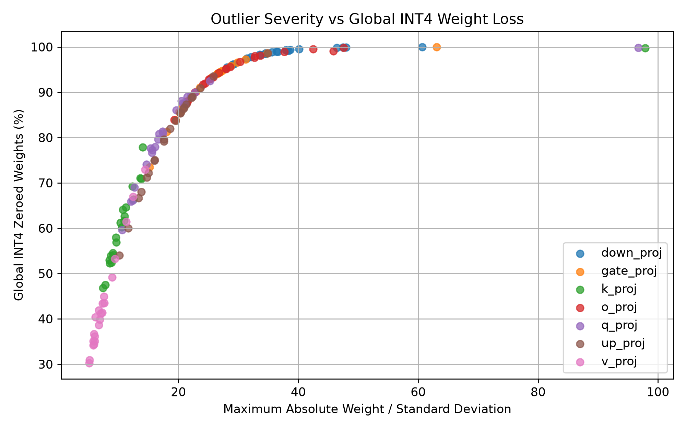
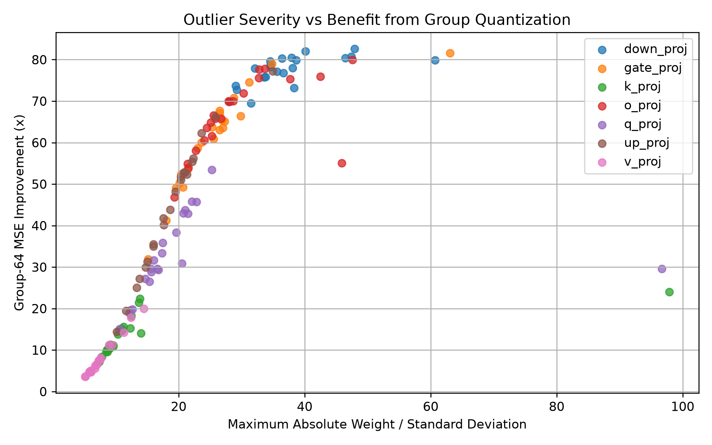
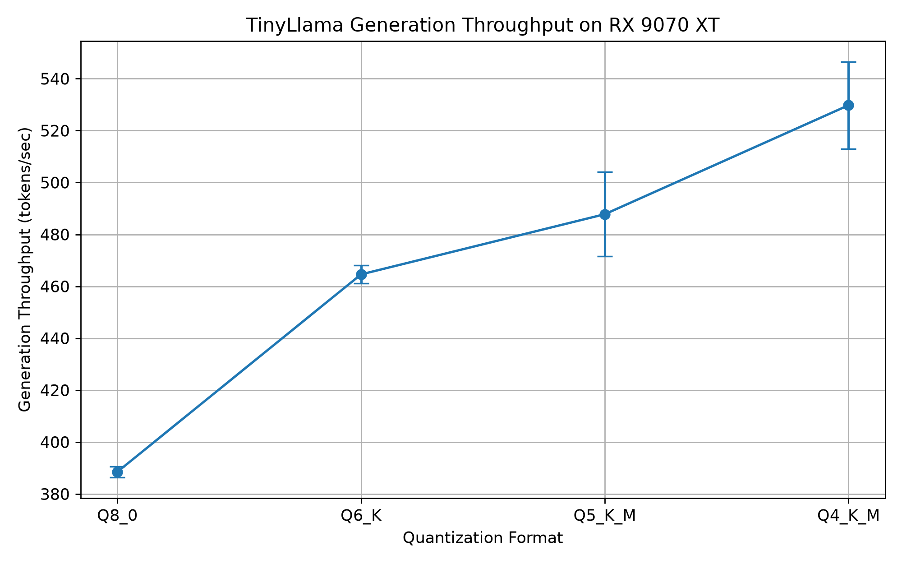

# LLM Quantization: Error, Outliers, and Hardware Performance

This repository isolates the mathematical mechanics of quantization error by tracking how precision loss scales from synthetic PyTorch tensors up to real LLM layers and physical hardware execution.

## Project Features

* **Baseline Testing:** Custom INT8 and INT4 symmetric quantization built in PyTorch to isolate baseline error without framework overhead.
* **Outlier Analysis:** Tracks how isolated extreme weights distort global scale factors and increase tensor-wide Mean Squared Error (MSE).
* **Mitigation:** Implements block-wise scaling to localize and limit outlier distortion.
* **Real-Model Validation:** Evaluates error propagation across the core linear layers of TinyLlama-1.1B.
* **Hardware Benchmarking:** GGUF inference speed profiling on an AMD Radeon RX 9070 XT (RDNA 4 architecture).

## Underlying Mathematics

Symmetric quantization in this project relies on absolute tensor maximums to isolate baseline error sources. For a floating-point weight tensor $W$, the scale factor ($s$) is derived from the largest absolute weight:

$$
s = \frac{\max(|W|)}{q_{\max}}
$$

where $q_{\max}=127$ for signed INT8 and $q_{\max}=7$ for signed symmetric INT4. Quantized weights ($q$) are mapped by dividing each weight by the scale factor and rounding to the nearest integer:

$$
q = \mathrm{round}\left(\frac{W}{s}\right)
$$

To evaluate precision loss, weights are dequantized ($\hat{W} = q \cdot s$) and evaluated against the original tensor using mean squared error (MSE), while also tracking the rate at which nonzero weights are rounded to zero.

## The Outlier Problem and Mitigation

Symmetric max-based quantization faces significant precision loss when handling extreme outliers. Because signed INT4 offers only 15 discrete levels (-7 to 7), a single high-magnitude weight stretches the quantization step size ($s$). This coarsens the representable levels for lower-magnitude weights, increasing reconstruction error and causing sufficiently small nonzero weights to round to zero.

To mitigate this, this implementation partitions tensors into local blocks (group quantization). Assigning independent scale factors isolates outliers to their specific group, protecting the precision of the surrounding tensor. To isolate the effect of outliers from bit width alone, controlled synthetic experiments injected individual outliers of increasing magnitude while holding the quantization method and bit width fixed.

## Real-Model Validation

The synthetic results were then tested across the linear weight matrices of TinyLlama-1.1B. Global INT4 quantization showed substantial variation between matrix families. Matrices containing more extreme weights relative to their standard deviation generally experienced greater zeroing and benefited more from localized scaling.

Across the analyzed matrices, the max-to-standard-deviation ratio was strongly associated with global INT4 zeroing (Spearman ρ = 0.999) and with the MSE improvement obtained using group-64 quantization (ρ = 0.953). This supports the same mechanism observed in the controlled synthetic experiments: extreme values can dominate a shared scale and reduce effective precision for the rest of the tensor.

## Hardware Performance

To connect numerical error with real-world execution performance, end-to-end inference was benchmarked locally using GGUF quantizations of TinyLlama-1.1B on an AMD Radeon RX 9070 XT (RDNA 4 architecture).

Lower precision reduced model size and increased token-generation throughput in these benchmarks. However, prompt-processing (prefill) performance did not scale monotonically with lower precision, demonstrating that reduced model size does not necessarily translate directly into proportional end-to-end performance gains.

| Quantization | Size (GB) | Generation (128 tokens/s) | Speedup vs. Q8 |
|---|---:|---:|---:|
| Q8_0 | 1.169 | 388.5 | — |
| Q6_K | 0.903 | 464.6 | 19.6% |
| Q5_K_M | 0.781 | 487.8 | 25.6% |
| Q4_K_M | 0.667 | 529.8 | 36.4% |

